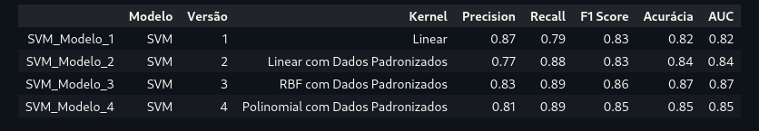

# Linear Regression Model for calculating Customer Credit Scores

Project aimed at creating, testing and evaluating an example of an SVM (Support Vector Machine) model that can be used to predict online retail purchases.

## Project phases

1. Exploratory data analysis

   * Verification of the general characteristics of the data;
   * Checking for missing data;
   * Checking for inconsistent data;
   * Attribute engineering.
2. Data visualization

   * Creation of tables and graphs;
3. Data transformation

   * Creation of new data columns;
   * Treatment of null or incorrect data;
   * Deletion of irrelevant data;
   * One Hot Encoding (adaptation of types according to the algorithm);
   * Balancing the target variable;
   * Separation of training and testing data;
   * Normalization and/or Standardization of data;
4. Creation, Testing and Evaluation of Linear Regression Models

   * Creation of models
     1 - SVM Model with Linear Kernel;
     2 - SVM Model with Linear Kernel and Standardized Data
     3 - SVM Model with RBF Kernel and Standardized Data
     4 - SVM Model with Polynomial Kernel and Standardized Data
   * Model training;
   * Model testing;
   * Evaluation of models;

## Technologies Used

This project was executed using the Python language in the Jupyter Notebook format. The libraries Pandas (Loading, Cleaning and Data Analysis), Matplotlib and Seaborn (Data visualization and graph generation), Sklearn (Creation, training and evaluation of the Machine Learning model), Git (Code versioning) and the The chosen IDE was Visual Studio Code, running on Debian Linux.

**Related links:**

* [Debian Linux](https://www.debian.org/index.pt.html)
* [VSCode](https://code.visualstudio.com/)
* [Python](https://www.python.org/)
* [Jupyter](https://jupyter.org/)
* [Pandas](https://pandas.pydata.org/)
* [Matplotlib](https://matplotlib.org/)
* [Seaborn](https://seaborn.pydata.org/#)
  [Sklearn](https://scikit-learn.org/stable/)
* [Git](https://git-scm.com/)

### Required Dependencies and Versions

The software and libraries used in the projects had the following versions:

* Python - Version: 3.11.5
* Pandas - Version: 2.2.0
* Matplotlib - Version: 3.8.3 (matplotlib-inline: 0.1.6)
* Seaborn - Version: 0.13.2
* Scikit-learn - Version: 1.4.1

**Note:** for more details see the file **"requirements.txt"**

## How to run the project

To run the project the following methods can be used:

#### *Method 1:* Download the project

**Step 1:**

On the project's main page [https://github.com/thaleswillreis/Modelo-ML-Previsao-Vendas-v1.git](https://github.com/thaleswillreis/Modelo-ML-Previsao-Vendas-v1.git), look for the green button labeled "<> Code".

**Step 2:**

Click "Download ZIP"

**Step 3:**

Unzip the folder you finished downloading.

**Step 4:**

Open projects containing the ".ipynb" extension.

#### *Method 2:* Clone the repository

Note: Before proceeding with this process, make sure that GitHub is properly configured on your computer.

**Step 1:**

Create a folder that you have write permissions to.

**Step 2:**

Open a terminal from the newly created folder or navigate to it through the terminal.

**Step 3:**

On the project's main page [https://github.com/thaleswillreis/Modelo-ML-Previsao-Vendas-v1.git](https://github.com/thaleswillreis/Modelo-ML-Previsao-Vendas-v1.git), look for the green button labeled "<> Code".

**Step 4:**

Copy the repository URL.

**Step 5:**

In the terminal type:

```
git Clone https://github.com/thaleswillreis/Modelo-ML-Previsao-Vendas-v1.git
```

Wait for the repository cloning to finish.

**Step 6:**

Open projects containing the ".ipynb" extension.

## Problems faced

The code may face problems when running using different versions of languages and libraries. Make sure that the versions listed in the "Required Dependencies and Versions" item are correctly installed.

If there is already a development environment with different versions in use on the machine used, a good alternative would be to create a virtual development environment. If in doubt, follow the documentation link.
[Virtual environments and packages](https://docs.python.org/pt-br/3/tutorial/venv.html)

## Results Obtained (Evaluation Metrics)



## Assessment Metrics:

#### **SVM_Model_1 (Linear):**

* **Kernel:** Linear
* **Data:** Not standardized
* **Metrics:**

  * **Precision:** 0.87
  * **Recall:** 0.79
  * **F1 Score:** 0.83
  * **Accuracy:** 0.82
  * **AUC:** 0.82

**Regarding the result:** This non-standard linear model appears to have good overall performance, with an accuracy of 82%. The accuracy is relatively high, indicating that the majority of instances predicted as positive actually are positive. However, the recall is slightly lower than the other models tested, suggesting that the model may miss some positive instances.

#### **SVM_Model_2 (Linear with Standardized Data):**

* **Kernel:** Linear
* **Data:** Standardized
* **Metrics:**

  * **Precision:** 0.77
  * **Recall:** 0.88
  * **F1 Score:** 0.83
  * **Accuracy:** 0.84
  * **AUC:** 0.84

**Regarding the result:** By standardizing the data, there was a notable improvement in recall (sensitivity), indicating that the model can capture more positive instances. However, accuracy has decreased, suggesting there may be more false positives.

#### **SVM_Model_3 (RBF with Standardized Data):**

* **Kernel:** RBF (Radial Basis Function)
* **Data:** Standardized
* **Metrics:**

  * **Precision:** 0.83
  * **Recall:** 0.89
  * **F1 Score:** 0.86
  * **Accuracy:** 0.87
  * **AUC:** 0.87

**Regarding the result:** The RBF model with standardized data presents a good combination of precision and recall, resulting in a solid F1 Score and AUC. This suggests that the model is capable of identifying positives with high sensitivity and still maintains good accuracy.

#### **SVM_Model_4 (Polynomial with Standardized Data):**

* **Kernel:** Polynomial
* **Data:** Standardized
* **Metrics:**

  * **Precision:** 0.81
  * **Recall:** 0.89
  * **F1 Score:** 0.85
  * **Accuracy:** 0.85
  * **AUC:** 0.85

**Regarding the result:** The polynomial model with standardized data has a solid performance, with an accuracy of 85%. Accuracy is good, indicating that most positive predictions are correct. Recall is high, suggesting that the model is able to identify most positive instances.

## Conclusion

From the results obtained, we can deduce that the choice between models may depend on the specific requirements of the problem. If the emphasis is on avoiding false positives, SVM_Model_3 (RBF) may be preferable. If the focus is on general equilibrium, SVM_Model_4 (Polynomial) can be a solid choice. Data standardization, on the other hand, seems to be quite beneficial for the general performance of the SVM models tested. And fine-tuning the hyperparameters using Grid Search seems to have contributed to improving the models' performance.

## Final considerations

If this content is useful to you, you have any questions or want to contribute to some improvement, leave your comment or contribute to the project.
